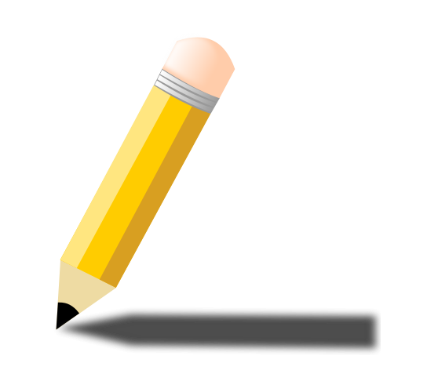

<h3 align="center">AI Engineer</h3>

  <em>
    I'm trying to gain foundational knowledge and skills in artificial intelligence such as machine learning, deep learning, natural language processing, and computer vision. By acquiring these skills, an AI engineer can become proficient in designing, developing, and implementing AI-based solutions. Ultimately, my objective is to establish a strong foundation in AI and to develop the skills necessary to excel in this rapidly evolving field.
  </em> 
   
  <b><i><h3 align="center">Thought : "Work hard in silence, let your success be your noise!”</h3></i></b>

 

###  ***About Me***
-  I'm always eager to learn new things day by day
- 👯 I'm really interested in science and technology in the world
- ⚡ Fun fact: I'm really into soccer and my favorite team is FC Bayern Munich 
 

### ***💻 Tech Skills***
                

### ***📊 GitHub Profile Stats***

|Github Stats | Top Languages |
|-------------|---------------|
|||

<picture>
  <source media="(prefers-color-scheme: dark)" srcset="github-snake-dark.svg" />
  <source media="(prefers-color-scheme: light)" srcset="github-snake.svg" />
  
</picture>

  <i>Let's connect and chat! Nice to meet you.</i>

  

    	<code></code>
	<code></code>
	<code></code>
  

